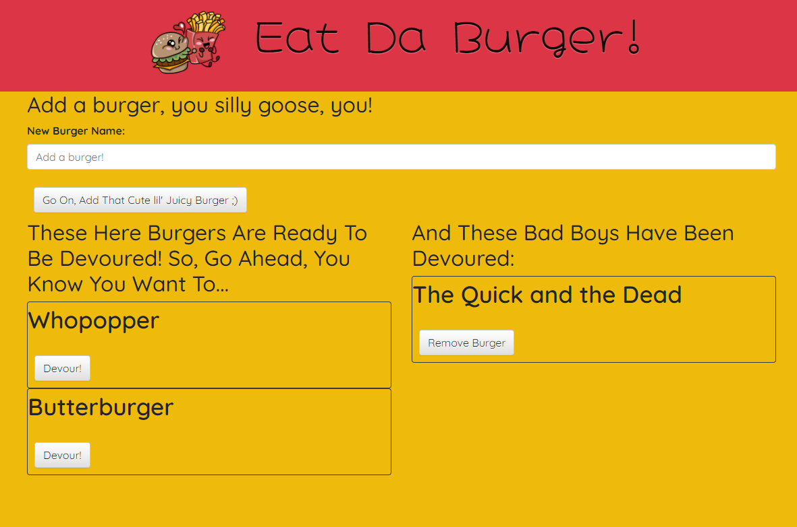

# burgerapp
This live application allows you to see the burgers, add new burgers, devour the burgers, and delete the devoured burgers using Node.js, Express, Express-Handlebars, and MySQL.

## Screenshots

## Getting Started
Click [here](https://cryptic-brushlands-50652.herokuapp.com/) to see it in action!

## Built With
* [Visual Studio Code](https://code.visualstudio.com/docs/setup/setup-overview)
* [Visual Studio Code Extension "Live Server"] 
    * Open VS Code.
    * Open the extensions pane and search for Live Server.
    * Select the version written by Ritwick Dey and click Install.
* [Git Terminal](https://git-scm.com/downloads)
* [Node](https://nodejs.org/en/download/)
     * [express](https://www.npmjs.com/package/express)
     * [mysql](https://www.npmjs.com/package/mysql)
     * [express-handlebars](https://www.npmjs.com/package/express-handlebars)
       

## Contributing
This project is not open to contributions at this time.

## Versioning
This project does not use versions at this time. 

## Authors
© 2020 [Phillip Merriman](https://github.com/phillipmerriman)

## License
MIT

## Acknowledgments
Thanks to the following:
* U of M Coding Bootcamp (https://bootcamp.umn.edu/coding/)
* Esterling Accime (https://www.youtube.com/channel/UC81OIFgbiCv9lE2ws07lsjA)
* Node (https://nodejs.org/en/download/)
     * mysql
* Git Terminal (https://git-scm.com/downloads)